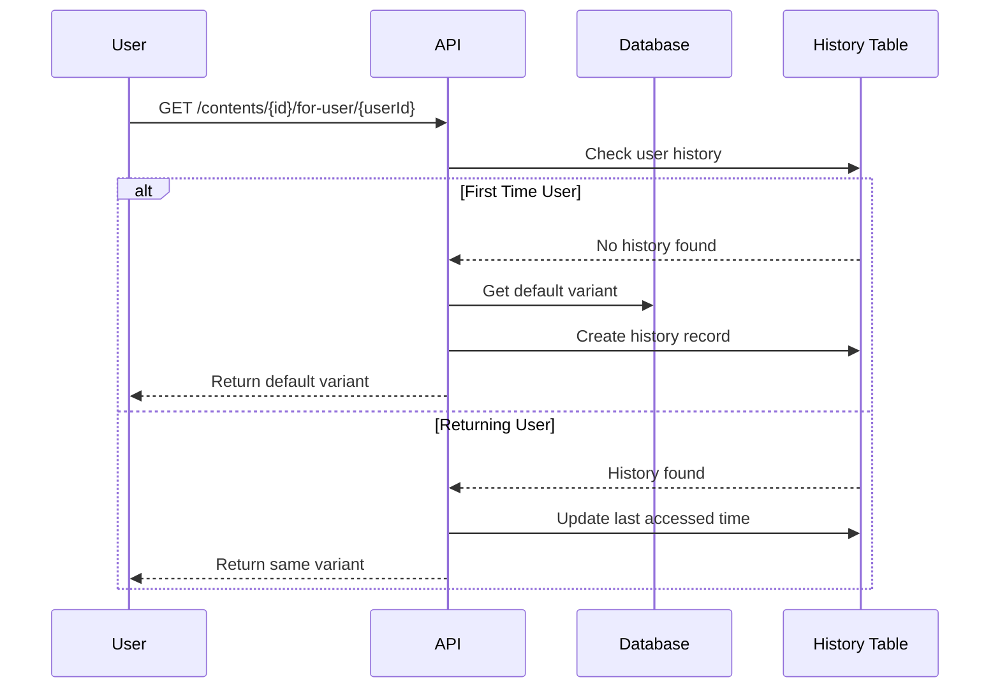

# 📋 NetCore CMS - İçerik Yönetim Sistemi

[](https://dotnet.microsoft.com/)
[](https://www.postgresql.org/)
[](https://www.docker.com/)
[](https://docs.microsoft.com/en-us/ef/)
[](https://blog.cleancoder.com/uncle-bob/2012/08/13/the-clean-architecture.html)
[](https://en.wikipedia.org/wiki/SOLID)

## 🎯 Proje Tanımı

NetCore CMS, modern yazılım geliştirme prensipleri ile tasarlanmış gelişmiş bir **İçerik Yönetim Sistemi**dir. Clean Architecture ve SOLID prensiplerine uygun olarak geliştirilmiş bu sistem, **stateful varyant yönetimi**, **A/B testing**, **performans optimizasyonları** ve **kapsamlı cache mekanizması** ile kullanıcıların içeriklerle etkileşim kurmasına olanak tanır.

### 🌟 Temel Özellikler

- ✅ **Stateful Varyant Yönetimi**: Kullanıcılar aynı içeriğe tekrar eriştiklerinde aynı varyantı görürler
- ✅ **A/B Testing Desteği**: İçerik varyantları ile kullanıcı davranışları analiz edilebilir
- ✅ **Çok Dilli İçerik**: Türkçe (tr) ve İngilizce (en) dil desteği
- ✅ **Performans Odaklı**: In-Memory cache ile hızlı yanıt süreleri
- ✅ **RESTful API**: Swagger dokümantasyonu ile tam API desteği
- ✅ **Veritabanı İlişkileri**: Foreign key kısıtları ve referential integrity
- ✅ **İşlem Güvenliği**: Transaction yönetimi ve ACID uyumluluğu

## 🏗️ Mimari Yapı

Proje **Clean Architecture** prensiplerine göre 4 katmanlı olarak tasarlanmıştır:

```
NetCoreCase/
├── src/
│   ├── NetCoreCase.Domain/          # 🏛️ Domain Katmanı
│   │   ├── Entities/                # Domain Modelleri & BaseEntity
│   │   ├── Interfaces/              # Repository Arayüzleri
│   │   └── Constants/               # Domain Sabitleri (LanguageConstants)
│   ├── NetCoreCase.Application/     # 🔧 Application Katmanı
│   │   ├── DTOs/                    # Data Transfer Objects
│   │   │   ├── Content/             # İçerik DTOs (Create, Update, Variant, History)
│   │   │   ├── Category/            # Kategori DTOs
│   │   │   └── User/                # Kullanıcı DTOs
│   │   ├── Interfaces/              # Service Arayüzleri (IContentService, ICacheService)
│   │   └── Services/                # İş Mantığı Servisleri
│   ├── NetCoreCase.Infrastructure/  # 🗄️ Infrastructure Katmanı
│   │   ├── Data/                    # DbContext, Repository & UnitOfWork
│   │   │   ├── Repositories/        # Repository Implementasyonları
│   │   │   └── ApplicationDbContext.cs
│   │   ├── Services/                # Cache Service Implementasyonu
│   │   └── Migrations/              # Entity Framework Migrations
│   └── NetCoreCase.API/            # 🌐 Presentation Katmanı
│       ├── Controllers/             # API Controllers (Contents, Users, Categories)
│       ├── Extensions/              # Service Registration Extensions
│       ├── Middleware/              # Error Handling Middleware
│       └── Program.cs               # Uygulama Giriş Noktası
├── docker-compose.yml              # 🐳 Docker Konfigürasyonu
└── docs/                           # 📖 Dokümantasyon
    └── DETAILED_USAGE.md           # Detaylı Kullanım Kılavuzu
```

## 🛠️ Kullanılan Teknolojiler

### Backend Stack
- **.NET 9.0** - Ana framework
- **ASP.NET Core Web API** - REST API geliştirme
- **Entity Framework Core 9.0** - ORM ve veritabanı yönetimi
- **PostgreSQL 15** - Ana veritabanı
- **Npgsql** - PostgreSQL .NET provider

### Mimari Desenler & Prensipler
- **Clean Architecture** - Robert C. Martin'in Clean Architecture modeli
- **Repository Pattern** - Veri erişim katmanı soyutlaması
- **Unit of Work Pattern** - İşlem bütünlüğü yönetimi
- **SOLID Principles** - Yazılım tasarım prensipleri
- **Dependency Injection** - IoC container ile bağımlılık yönetimi

### Performance & Caching
- **In-Memory Caching** - Microsoft.Extensions.Caching.Memory
- **Custom Cache Service** - Pattern-based cache invalidation
- **Async/Await** - Tüm I/O işlemleri asenkron

### DevOps & Tooling
- **Docker & Docker Compose** - Konteynerizasyon
- **pgAdmin** - PostgreSQL yönetim arayüzü
- **Swagger/OpenAPI** - API dokümantasyonu
- **Mapster** - Object-to-object mapping

## 📊 Domain Modelleri ve İlişkiler

### 🧑 User (Kullanıcı)
```csharp
public class User : BaseEntity
{
    public string FullName { get; set; }      // Ad Soyad (Max: 100 karakter)
    public string Email { get; set; }         // E-posta (Unique, Max: 255 karakter)
    
    // Navigation Properties
    public virtual ICollection<Content> Contents { get; set; }  // Kullanıcının İçerikleri
}
```

### 📂 Category (Kategori)
```csharp
public class Category : BaseEntity
{
    public string Name { get; set; }          // Kategori Adı (Unique, Max: 100 karakter)
    public string Description { get; set; }   // Açıklama (Max: 500 karakter)
    
    // Navigation Properties
    public virtual ICollection<Content> Contents { get; set; }  // Kategorideki İçerikler
}
```

### 📄 Content (İçerik) - **Ana Entity**
```csharp
public class Content : BaseEntity
{
    public string Title { get; set; }         // Başlık (Max: 200 karakter) ⭐
    public string Description { get; set; }   // Açıklama (Max: 1000 karakter) ⭐
    public string Language { get; set; }      // Dil (en, tr) ⭐
    public string ImageUrl { get; set; }      // Görsel URL (Max: 500 karakter) ⭐
    
    // Foreign Keys
    public Guid UserId { get; set; }          // İçerik Sahibi ⭐
    public Guid CategoryId { get; set; }      // İçerik Kategorisi ⭐
    
    // Navigation Properties
    public virtual User User { get; set; }
    public virtual Category Category { get; set; }
    public virtual ICollection<ContentVariant> Variants { get; set; }  // İçerik Varyantları ⭐
}
```

### 🔄 ContentVariant (İçerik Varyantı) - **A/B Testing**
```csharp
public class ContentVariant : BaseEntity
{
    public Guid ContentId { get; set; }       // Bağlı İçerik ⭐
    public string VariantData { get; set; }   // Varyant Verisi (Max: 2000 karakter) ⭐
    public bool IsDefault { get; set; }       // Varsayılan Varyant mı? ⭐
    
    // Navigation Properties
    public virtual Content Content { get; set; }
}
```

### 📈 UserContentVariantHistory (Stateful Yönetim) - **Yeni!**
```csharp
public class UserContentVariantHistory : BaseEntity
{
    public Guid UserId { get; set; }          // Kullanıcı ID
    public Guid ContentId { get; set; }       // İçerik ID
    public Guid VariantId { get; set; }       // Gösterilen Varyant ID
    public DateTime ViewedAt { get; set; }    // İlk Görüntüleme Zamanı
    public DateTime LastAccessedAt { get; set; } // Son Erişim Zamanı
    public int ViewCount { get; set; }        // Görüntüleme Sayısı
    
    // Navigation Properties
    public virtual User User { get; set; }
    public virtual Content Content { get; set; }
    public virtual ContentVariant Variant { get; set; }
}
```

### 🏛️ BaseEntity (Ortak Özellikler)
```csharp
public abstract class BaseEntity
{
    public Guid Id { get; set; }              // Benzersiz Kimlik
    public DateTime CreatedAt { get; set; }   // Oluşturulma Zamanı
    public DateTime? UpdatedAt { get; set; }  // Güncelleme Zamanı
}
```

## 🚀 Kurulum ve Çalıştırma

### Ön Gereksinimler
- [.NET 9.0 SDK](https://dotnet.microsoft.com/download) ⚡
- [Docker Desktop](https://www.docker.com/products/docker-desktop) 🐳
- [Git](https://git-scm.com/) 📥

### 1️⃣ Projeyi Klonlama
```bash
git clone https://github.com/your-username/NetCoreCase.git
cd NetCoreCase
```

### 2️⃣ PostgreSQL Veritabanını Başlatma
```bash
# Docker konteynerlerini başlat
docker-compose up -d

# Konteyner durumunu kontrol et
docker ps
```

### 3️⃣ Veritabanı Migration'larını Uygulama
```bash
# API dizinine geç
cd src/NetCoreCase.API

# Migration'ları çalıştır
dotnet ef database update
```

### 4️⃣ Uygulamayı Çalıştırma
```bash
# API'yi başlat (Swagger otomatik açılacak)
dotnet run
```

## 🌐 Erişim Bilgileri

### 🎯 API Endpoints
- **API Base URL**: `https://localhost:5001` / `http://localhost:5000`
- **Swagger UI**: `https://localhost:5001/` (Otomatik açılır)
- **Health Check**: `https://localhost:5001/health`
- **API Info**: `https://localhost:5001/api/info`

### 🗄️ Veritabanı Erişimi
**PostgreSQL:**
- **Host**: `localhost:5433`
- **Database**: `NetCoreCaseDB`
- **Username**: `admin`
- **Password**: `admin123`

**pgAdmin Web Interface:**
- **URL**: `http://localhost:8080`
- **Email**: `admin@admin.com`
- **Password**: `admin123`

## 📋 API Endpoints - Kapsamlı Referans

### 👤 Users Management
```http
GET    /api/users                     # Tüm kullanıcıları listele
GET    /api/users/{id}                # Kullanıcı detayını getir
GET    /api/users/by-email/{email}    # E-posta ile kullanıcı bul
GET    /api/users/{id}/with-contents  # Kullanıcı ve içeriklerini getir
POST   /api/users                     # Yeni kullanıcı oluştur
PUT    /api/users/{id}                # Kullanıcı güncelle
DELETE /api/users/{id}                # Kullanıcı sil
GET    /api/users/check-email/{email} # E-posta kullanım kontrolü
```

### 📂 Categories Management
```http
GET    /api/categories                # Tüm kategorileri listele
GET    /api/categories/{id}           # Kategori detayını getir
GET    /api/categories/by-name/{name} # İsim ile kategori bul
GET    /api/categories/{id}/with-contents # Kategori ve içeriklerini getir
POST   /api/categories                # Yeni kategori oluştur
PUT    /api/categories/{id}           # Kategori güncelle
DELETE /api/categories/{id}           # Kategori sil
GET    /api/categories/check-name/{name} # İsim kullanım kontrolü
```

### 📄 Contents Management (Ana Özellikler)
```http
# Temel CRUD İşlemleri
GET    /api/contents                  # Tüm içerikleri listele
GET    /api/contents/{id}             # İçerik detayını getir
POST   /api/contents                  # Yeni içerik oluştur (min 2 varyant)
PUT    /api/contents/{id}             # İçerik güncelle
DELETE /api/contents/{id}             # İçerik sil

# Filtreleme ve Arama
GET    /api/contents/by-user/{userId}                    # Kullanıcıya göre filtrele
GET    /api/contents/by-category/{categoryId}           # Kategoriye göre filtrele
GET    /api/contents/by-language/{language}             # Dile göre filtrele (tr/en)
GET    /api/contents/by-category/{categoryId}/language/{language} # Çoklu filtre
GET    /api/contents/search?searchTerm={term}           # Arama (başlık, açıklama, kategori, kullanıcı)

# Varyant Görüntüleme
GET    /api/contents/{id}/with-variants                 # İçerik + tüm varyantları
```

### 🔄 Variant Management (A/B Testing)
```http
# Temel Varyant İşlemleri
GET    /api/contents/{contentId}/variants/default       # Varsayılan varyant
GET    /api/contents/{contentId}/variants/user/{userId} # Kullanıcıya özel varyant
POST   /api/contents/{contentId}/variants               # Yeni varyant ekle
PUT    /api/contents/{contentId}/variants/{variantId}/set-default # Varsayılan varyant değiştir
```

### 📈 Stateful Variant Management (Yeni Özellik!)
```http
# Stateful İçerik Erişimi
GET    /api/contents/{contentId}/for-user/{userId}      # Kullanıcıya özel stateful içerik

# Kullanıcı Görüntüleme Geçmişi
GET    /api/contents/users/{userId}/view-history        # Kullanıcının tüm geçmişi
GET    /api/contents/users/{userId}/content-history/{contentId} # Belirli içerik geçmişi
```

## 🎯 Önemli İş Kuralları ve Özellikler

### 🔄 Stateful Varyant Yönetimi
Bu sistem, kullanıcıların bir içeriği gördüklerinde **aynı varyantı** tekrar görmeleri için tasarlanmıştır:



### 📝 İçerik Oluşturma Kuralları
- ✅ **Minimum 2 varyant** zorunludur
- ✅ **Maksimum 1 default varyant** olabilir
- ✅ Eğer default varyant belirtilmezse, **ilk varyant default** olur
- ✅ **Dil kontrolü**: Sadece `tr` ve `en` kabul edilir
- ✅ **Kullanıcı ve kategori kontrolü**: Geçerli ID'ler olmalıdır

### 🗃️ Cache Stratejisi
```json
{
  "CacheSettings": {
    "DefaultExpiration": "00:30:00",      // 30 dakika
    "UserCacheExpiration": "00:15:00",    // 15 dakika
    "CategoryCacheExpiration": "00:30:00", // 30 dakika
    "ContentCacheExpiration": "00:15:00",  // 15 dakika
    "SearchCacheExpiration": "00:05:00"    // 5 dakika
  }
}
```

**Cache Invalidation Kuralları:**
- ✅ **CREATE/UPDATE/DELETE** işlemlerinde tüm cache temizlenir
- ✅ **Pattern-based** cache temizleme destegi
- ✅ **Memory-efficient** cache yönetimi

### 🔒 Veritabanı Kısıtları
- **Users**: E-posta unique, max 255 karakter
- **Categories**: İsim unique, max 100 karakter
- **Contents**: Title max 200, Description max 1000 karakter
- **ContentVariants**: VariantData max 2000 karakter
- **Languages**: Sadece 'tr' ve 'en' kabul edilir

## 🧪 Test Verileri (Seed Data)

Sistem otomatik olarak aşağıdaki test verilerini oluşturur:

### 📂 Kategoriler (Categories)
```json
[
  {
    "name": "Teknoloji",
    "description": "Teknoloji ile ilgili içerikler"
  },
  {
    "name": "Sağlık", 
    "description": "Sağlık ile ilgili içerikler"
  },
  {
    "name": "Eğitim",
    "description": "Eğitim ile ilgili içerikler"
  }
]
```

### 👥 Kullanıcılar (Users)
```json
[
  {
    "fullName": "Ahmet Yılmaz",
    "email": "ahmet@example.com"
  },
  {
    "fullName": "Ayşe Demir", 
    "email": "ayse@example.com"
  }
]
```

## 📖 Detaylı Kullanım Kılavuzu

Kapsamlı kullanım senaryoları ve örnekler için: **[DETAILED_USAGE.md](docs/DETAILED_USAGE.md)** dosyasına bakınız.

### Hızlı Başlangıç Örnekleri

#### 1️⃣ Yeni İçerik Oluşturma
```bash
curl -X POST "https://localhost:5001/api/contents" \
  -H "Content-Type: application/json" \
  -d '{
    "title": "React ile Modern Web Geliştirme",
    "description": "React framework kullanarak modern web uygulamaları geliştirme",
    "language": "tr",
    "imageUrl": "https://example.com/react-image.jpg",
    "userId": "550e8400-e29b-41d4-a716-446655440000",
    "categoryId": "550e8400-e29b-41d4-a716-446655440001",
    "variants": [
      {
        "variantData": "React, modern web geliştirme için popüler bir JavaScript kütüphanesidir.",
        "isDefault": true
      },
      {
        "variantData": "React ile component-based architecture kullanarak ölçeklenebilir uygulamalar geliştirin.",
        "isDefault": false
      }
    ]
  }'
```

#### 2️⃣ Kullanıcıya Özel Stateful İçerik Erişimi
```bash
# İlk erişim - default varyant döner
curl -X GET "https://localhost:5001/api/contents/{contentId}/for-user/{userId}"

# İkinci erişim - aynı varyant döner (stateful)
curl -X GET "https://localhost:5001/api/contents/{contentId}/for-user/{userId}"
```

## 🔧 Geliştirme Araçları

### Migration Yönetimi
```bash
# Yeni migration oluştur
dotnet ef migrations add MigrationName

# Migration'ı uygula
dotnet ef database update

# Migration'ı geri al
dotnet ef migrations remove

# Veritabanını sıfırla
dotnet ef database drop
```

### Docker Yönetimi
```bash
# Servisleri başlat
docker-compose up -d

# Logları izle
docker-compose logs -f

# Servisleri durdur
docker-compose down

# Verileri de sil
docker-compose down -v
```

## 🐛 Sorun Giderme

### ❌ Yaygın Sorunlar ve Çözümleri

**1. PostgreSQL Bağlantı Hatası**
```bash
# Konteyner durumunu kontrol et
docker ps

# PostgreSQL loglarını incele
docker logs netcorecase_postgres

# Portu kontrol et
netstat -an | findstr :5433
```

**2. Migration Hatası**
```bash
# Mevcut migration'ları kontrol et
dotnet ef migrations list

# Son migration'ı geri al
dotnet ef migrations remove
```

**3. Cache Sorunları**
- API'yi yeniden başlatın (in-memory cache temizlenir)
- Veya `/health` endpoint'ini çağırarak cache'i test edin

## 📊 Performans ve İstatistikler

### 🚀 Optimizasyon Özellikleri
- **Database Indexing**: Composite indexler ile hızlı sorgular
- **Lazy Loading**: İhtiyaç duyulan veriler lazy loading ile yüklenir
- **Async Operations**: Tüm I/O işlemleri asenkron
- **Connection Pooling**: PostgreSQL connection pooling
- **Memory Caching**: 15-30 dakika cache süresi

### 📈 Monitoring Endpoints
```http
GET /health                    # Sistem sağlık kontrolü
GET /api/info                  # API bilgileri
```

## 🤝 Katkıda Bulunma

1. 🍴 Projeyi fork edin
2. 🌿 Feature branch oluşturun (`git checkout -b feature/amazing-feature`)
3. 💾 Değişikliklerinizi commit edin (`git commit -m 'Add amazing feature'`)
4. 📤 Branch'i push edin (`git push origin feature/amazing-feature`)
5. 🔄 Pull Request oluşturun

### 📋 Katkı Kuralları
- Clean Code prensiplerine uyun
- Unit testler ekleyin
- API dokümantasyonunu güncelleyin
- Migration'ları test edin

## 📄 Lisans

Bu proje [MIT](https://choosealicense.com/licenses/mit/) lisansı altında lisanslanmıştır.

## 📞 İletişim ve Destek

**Proje Geliştiricisi**: [your-email@example.com](mailto:your-email@example.com)  
**Proje Repository**: [https://github.com/your-username/NetCoreCase](https://github.com/your-username/NetCoreCase)  
**Issues**: [GitHub Issues](https://github.com/your-username/NetCoreCase/issues)  
**Wiki**: [GitHub Wiki](https://github.com/your-username/NetCoreCase/wiki)

---

## 🎖️ Teknical Badges

[](https://localhost:5001/swagger)
[](https://www.postgresql.org/)
[](https://docs.microsoft.com/en-us/aspnet/core/performance/caching/memory)
[](https://blog.cleancoder.com/uncle-bob/2012/08/13/the-clean-architecture.html)

⭐ **Bu projeyi beğendiyseniz yıldızlamayı unutmayın!** ⭐

---

## 🔗 Faydalı Linkler

- 📖 [Detaylı Kullanım Kılavuzu](docs/DETAILED_USAGE.md)
- 🏗️ [Clean Architecture Rehberi](https://blog.cleancoder.com/uncle-bob/2012/08/13/the-clean-architecture.html)
- 🔧 [Entity Framework Core Dokümantasyonu](https://docs.microsoft.com/en-us/ef/core/)
- 🐳 [Docker Compose Rehberi](https://docs.docker.com/compose/)
- 📊 [PostgreSQL Performans Tuning](https://www.postgresql.org/docs/current/performance-tips.html) 